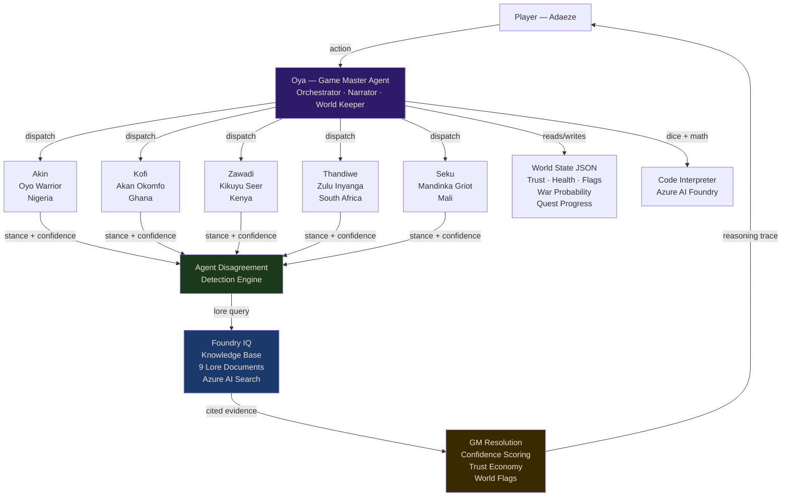

# Sixteen Threads

**Track:** Reasoning Agents (Battle #2) — Microsoft Agents League Hackathon 2026
**Challenge:** Challenge B — Role-Play Game System
**Team:** Zee (Mary Ezinne Obasi)

---

## What It Is

Sixteen Threads is a multi-agent reasoning RPG grounded in West African mythology. Six AI agents reason, conflict, and deliberate about whether to go to war over a broken sacred covenant. The player directs the story. The agents disagree in character and the GM resolves conflicts with a visible reasoning trace.

The setting draws from Yoruba, Akan, Kikuyu, Zulu, and Mandinka traditions. The story follows Adaeze, a diplomatic emissary from Ile-Olu, sent to investigate why the Aso-Ijo — the covenant cloth holding the spirit realm and the mortal world apart — has been torn.

---

## The Six Agents

| Agent | Name | Culture | War Stance | Tools |
|---|---|---|---|---|
| Game Master | Oya | Pan-African | Orchestrator | Code Interpreter |
| Warrior | Akin Adesanya | Yoruba/Nigeria | Prepare for war | None |
| Diviner | Kofi Mensah-Asante | Akan/Ghana | Against war | None |
| Seer | Zawadi wa Muthoni | Kikuyu/Kenya | Pattern decides | None |
| Healer | Thandiwe Dlamini | Zulu/South Africa | No premature war | Code Interpreter |
| Rival | Seku Kouyaté | Mandinka/Mali | Concealed | None |

Each agent carries hidden knowledge, emotional memory, and a distinct cultural voice. Agents genuinely conflict. The GM resolves conflicts using a weighted confidence algorithm with Foundry IQ evidence.

---

## Architecture



---

## Foundry IQ Integration

The knowledge base `sixteen-threads-lore` is configured in Microsoft Foundry with `text-embedding-3-large` embeddings and Medium retrieval reasoning effort.

Nine synthetic lore documents are indexed:

- `01_world_overview.md` — Aye-Orun cosmology, the Aso-Ijo covenant, the seven kingdoms
- `02_characters.md` — Full profiles for all 6 agents with hidden knowledge marked
- `03_factions.md` — Kingdom factions and the sealed Ìmọlẹ̀ Tuntun antagonist faction
- `04_locations.md` — Ori-Oke shrine, Ile-Olu, the road between them, the spirit realm
- `05_quests.md` — Main quest with consequence propagation, 4 endings, 2 side quests
- `06_artifacts.md` — The Aso-Ijo cloth, Nri nail, Seku's kora, all key objects
- `07_bestiary.md` — Boundary-straddlers, Ogun-Ibi, the Holding Court guardians
- `08_homebrew_rules.md` — Trust economy, disagreement resolution, dice mechanics
- `09_session_state_template.md` — World state JSON schema with all agent fields

All lore is original synthetic content. No real names, no PII, no copyrighted settings.

At runtime, the GM agent queries Foundry IQ before narrating any lore-dependent scene. Retrieved results include source file citations and relevance scores.

---

## Agent Architecture Decision

Agents are provisioned through Microsoft Azure AI Foundry and visible in the Foundry portal under the Sixteen-Threads project. All six agents run on `gpt-4.1-mini` deployed in East US 2.

Runtime calls use the Azure OpenAI compatible endpoint exposed by Foundry. This is a deliberate architectural choice: the OpenAI Assistants API provides full thread, message, and run lifecycle management while the agents themselves remain hosted and managed within Foundry. The agent IDs, system prompts, and tool configurations are all defined and stored in Foundry. The runtime client simply invokes them.

This pattern separates agent definition (Foundry) from agent invocation (compatible endpoint), which is the same separation recommended for production Foundry deployments.

---

## Reasoning System

The core differentiator is the disagreement resolution engine in `game_engine/disagreement.py`.

When agents conflict, the GM runs this pipeline:

1. Each agent states a position with a confidence score
2. The GM queries Foundry IQ for relevant lore evidence
3. Evidence adjusts each agent's confidence score up or down
4. Positions are weighted by confidence multiplied by credibility
5. The winning position is selected with a final confidence score
6. Trust scores update for all agents based on outcome
7. World flags are set to propagate consequences downstream
8. The full reasoning trace is logged and displayed to the player

Every decision is visible. Players see exactly why the GM resolved the conflict the way it did.

Three pre-built disagreement scenarios drive the demo:

- DN-01: The shadowless figure. Akin wants confrontation. Kofi wants patience. Zawadi proposes a third option.
- DN-02: The Nri nail. Akin calls it a declaration of war. Zawadi identifies it as misdirection. The nail is forty years old.
- DN-03: The war debate. All five agents simultaneously. The player casts the deciding vote.

---

## World State

The world state JSON tracks every variable that matters:

- Trust scores for all 6 agents (0 to 100)
- War probability (calculated from flag combinations)
- Active world flags (aso_ijo_torn, moremi_displaced, seku_listened_to, etc.)
- Agent emotional states and hidden knowledge
- Quest progress and consequence chains
- Reasoning trace log for every GM decision

State persists across turns. Every agent reads the current state before responding. Every GM decision writes state updates.

---

## Synthetic Data Compliance

All data in this project is original synthetic content created for this submission.

- No real names, email addresses, or identifiable information
- No copyrighted mythology, published characters, or proprietary lore
- All place names, faction names, and character names are original
- All documents are clearly fictional and marked as synthetic
- The `09_session_state_template.md` uses clearly fictional identifiers

---
## Responsible AI

- Agents are transparent about being AI in all interactions
- The GM enforces narrative guardrails via system prompt instructions
- No harmful content is generated; the story involves political conflict, not violence
- The trust economy penalizes agents for deception, rewarding transparency
- Players retain full agency; no irreversible actions happen without player input
- Human-in-the-loop: the player casts the deciding vote in the war debate

---

## How to Run

```bash
git clone https://github.com/Ria-Zee/sixteen-threads
cd sixteen-threads
python3 -m venv .venv
source .venv/bin/activate
pip install -r requirements.txt
```

Create a `.env` file with your Azure credentials (see `.env.example`).

```bash
python3 agents/agent_factory.py
python3 main.py
```

Open `web/index.html` in Chrome for the cinematic intro.

---

## Project Structure

```
sixteen-threads/
├── agents/
│   ├── agent_factory.py       # Creates agents in Azure Foundry
│   ├── system_prompts.py      # All 6 agent system prompts
│   └── agent_ids.json         # Agent IDs (gitignored in production)
├── game_engine/
│   ├── world_state.py         # World state manager
│   ├── gm_orchestrator.py     # GM reasoning loop
│   ├── disagreement.py        # Conflict detection and resolution
│   └── foundry_iq.py          # Foundry IQ knowledge base queries
├── lore/                      # 9 synthetic lore documents
├── web/
│   └── index.html             # Cinematic web UI
├── main.py                    # Terminal game loop with Rich UI
└── README.md
```

---

## Demo Video

[https://youtu.be/gHLsou7U0ds]
[https://youtu.be/dImirkV2Syg]

The demo shows:
- 3 minutes: cinematic web UI with audio, animations, and story introduction
- 2 minutes: terminal gameplay with live agent reasoning, disagreement resolution, and GM narration

