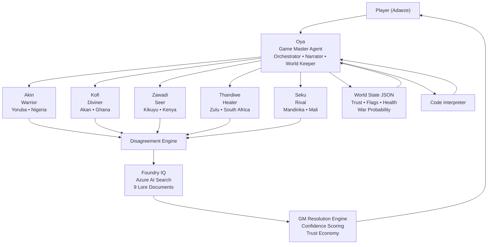

# Sixteen Threads Architecture

```mermaid
graph TD
    Player["Player (Adaeze)"]

    GM["Oya<br/>Game Master Agent<br/>Orchestrator • Narrator • World Keeper"]

    Akin["Akin<br/>Warrior<br/>Yoruba • Nigeria"]
    Kofi["Kofi<br/>Diviner<br/>Akan • Ghana"]
    Zawadi["Zawadi<br/>Seer<br/>Kikuyu • Kenya"]
    Thandiwe["Thandiwe<br/>Healer<br/>Zulu • South Africa"]
    Seku["Seku<br/>Rival<br/>Mandinka • Mali"]

    Disagree["Disagreement Engine"]

    IQ["Foundry IQ<br/>Azure AI Search<br/>9 Lore Documents"]

    Resolution["GM Resolution Engine<br/>Confidence Scoring<br/>Trust Economy"]

    State["World State JSON<br/>Trust • Flags • Health<br/>War Probability"]

    CI["Code Interpreter"]

    Player --> GM

    GM --> Akin
    GM --> Kofi
    GM --> Zawadi
    GM --> Thandiwe
    GM --> Seku

    Akin --> Disagree
    Kofi --> Disagree
    Zawadi --> Disagree
    Thandiwe --> Disagree
    Seku --> Disagree

    Disagree --> IQ
    IQ --> Resolution
    Resolution --> Player

    GM --> State
    State --> GM

    GM --> CI
    CI --> GM
```